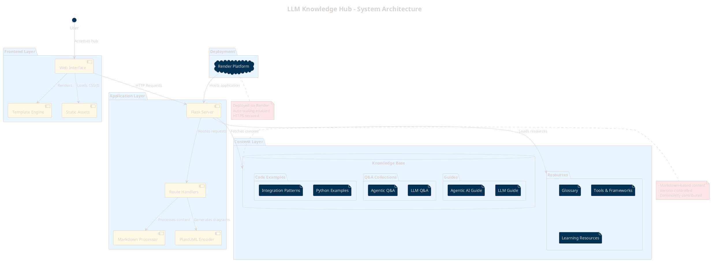
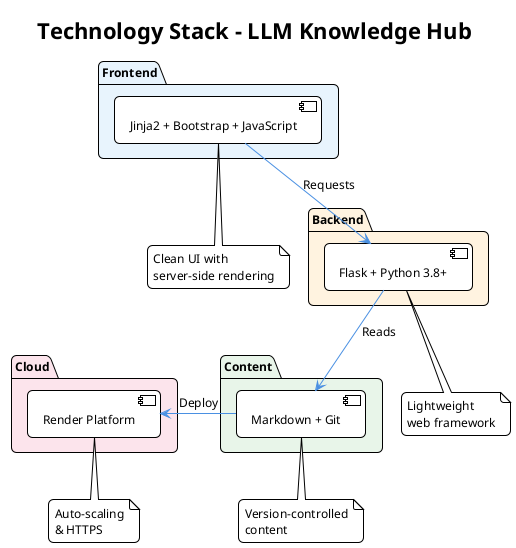
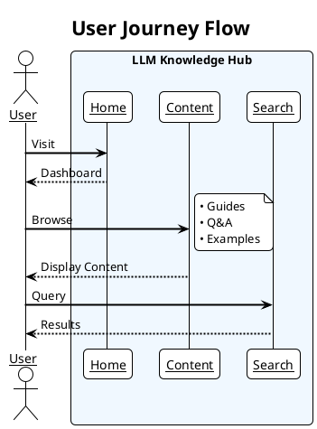
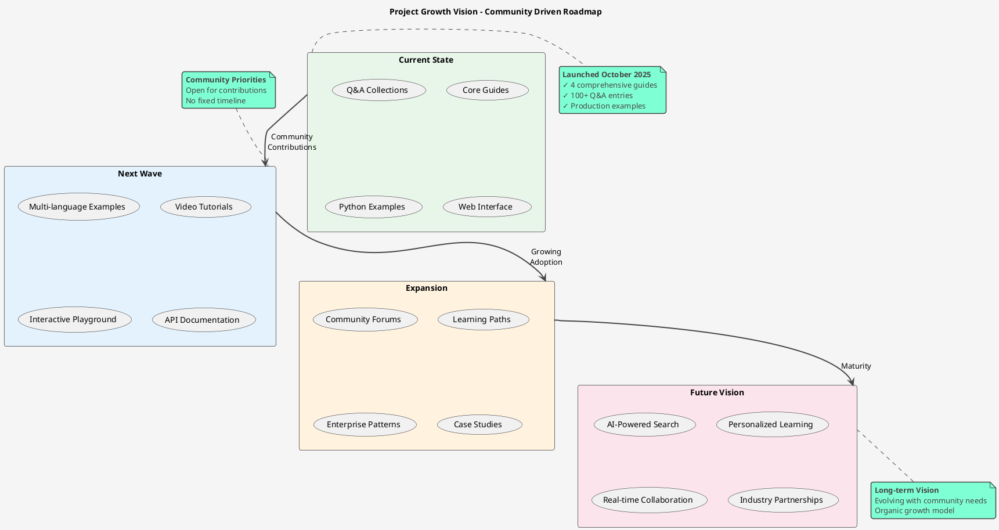

# Building an Open-Source LLM Knowledge Hub: A 12-Part Journey into AI Engineering Excellence

## 🚀 Introducing the LLM Knowledge Hub: Your Gateway to Mastering Large Language Models and Agentic AI

*Part 1 of a 12-article series on building and understanding the LLM Knowledge Hub - an open-source platform for AI engineers*

---

## The AI Revolution Needs Better Documentation

The landscape of artificial intelligence has transformed dramatically with the emergence of Large Language Models (LLMs) and Agentic AI systems. Yet, as these technologies rapidly evolve, developers and engineers face a critical challenge: **fragmented, scattered, and often outdated knowledge resources**. 

Today, I'm excited to introduce the **[LLM Knowledge Hub](https://github.com/OmarKAly22/llm-knowledge-hub)** - an ambitious open-source project that consolidates, organizes, and presents comprehensive knowledge about building with LLMs and AI agents. This is the first article in a 12-part series that will take you through every aspect of this project, from its architecture to advanced implementation strategies.

**Live Demo**: [https://llm-knowledge-hub.onrender.com/](https://llm-knowledge-hub.onrender.com/)

---

## 📊 Project Architecture Overview

Let me start with a high-level view of how the LLM Knowledge Hub is structured:



---

## 🎯 Why This Project Exists

### The Problem Space

Working with LLMs presents unique challenges that traditional software engineering resources don't address:

1. **Rapid Evolution**: New models, techniques, and best practices emerge weekly
2. **Scattered Knowledge**: Information spread across research papers, blog posts, documentation, and forums
3. **Practical Gap**: Academic research often lacks production-ready implementation guidance
4. **Quality Variance**: Difficulty distinguishing battle-tested practices from experimental approaches

### Our Solution

The LLM Knowledge Hub addresses these challenges by providing:

- **📚 Centralized Knowledge**: All essential LLM and Agentic AI concepts in one place
- **🔄 Living Documentation**: Community-driven updates keep content current
- **💻 Production Focus**: Emphasis on real-world, implementable solutions
- **🎓 Progressive Learning**: From fundamentals to advanced techniques

---

## 📋 What This Series Covers

Over the next 11 articles, we'll explore every aspect of building and understanding the LLM Knowledge Hub:

### Article Roadmap

1. **Introduction to the LLM Knowledge Hub** *(This article)*
   - Project overview and architecture
   - Why it matters for the AI community
   - Series roadmap

2. **The Complete Guide to Prompt Engineering**
   - Comprehensive prompt engineering techniques
   - From zero-shot to advanced patterns
   - Real-world examples and best practices

3. **Building with Flask: The Technical Foundation**
   - Flask application architecture
   - Route design and template system
   - Content management strategy

4. **Mastering LLM Development: Core Concepts**
   - LLM integration patterns
   - Context management strategies
   - Token optimization techniques

5. **Agentic AI Architecture: Building Autonomous Systems**
   - Agent design patterns
   - Tool integration and memory systems
   - Multi-agent orchestration

6. **RAG Implementation: Connecting LLMs to Your Data**
   - Retrieval-Augmented Generation deep dive
   - Vector databases and embedding strategies
   - Production RAG pipelines

7. **Testing and Evaluation in the Age of AI**
   - Non-deterministic system testing
   - Evaluation metrics for LLMs
   - Quality assurance strategies

8. **Security and Safety: Protecting AI Systems**
   - Prompt injection prevention
   - Data privacy considerations
   - Safety guardrails implementation

9. **Cost Optimization: Making AI Economically Viable**
   - Token usage optimization
   - Model selection strategies
   - Caching and efficiency patterns

10. **Open Source Contribution: Building Together**
    - Contributing to the Knowledge Hub
    - Community guidelines
    - Extending the platform

11. **Deployment and DevOps for AI Applications**
    - Render deployment configuration
    - Scaling strategies
    - Monitoring and maintenance

12. **Future of AI Engineering: Trends and Predictions**
    - Emerging patterns and technologies
    - The roadmap ahead
    - Building the next generation of AI systems

---

## 🛠️ Technical Stack

Let's examine the technology choices that power the Knowledge Hub:



### Why These Technologies?

- **Flask**: Lightweight, flexible, perfect for content-driven applications
- **Markdown**: Developer-friendly, version-controllable, easy to contribute
- **PlantUML**: Code-as-diagrams approach for maintainable visualizations
- **Render**: Simple deployment with automatic scaling and HTTPS

---

## 🌟 Key Features

### 1. Interactive Web Interface

The hub provides a clean, responsive interface for browsing content:



### 2. Comprehensive Content Structure

- **In-Depth Guides**: Complete walkthroughs of LLM and Agentic AI concepts
- **Quick Q&A**: Rapid answers to common questions
- **Production Examples**: Real code that works in production environments
- **Living Resources**: Continuously updated tools, frameworks, and learning materials

### 3. Developer-First Design

- Clean, readable markdown source files
- Git-based version control
- Simple contribution workflow
- No complex build process

---

## 💡 Who Should Follow This Series?

This series is designed for:

- **Software Engineers** transitioning to AI/ML development
- **ML Engineers** looking to master LLM applications
- **Technical Leaders** making architectural decisions
- **Product Managers** understanding AI capabilities
- **Students & Researchers** learning modern AI engineering
- **Open Source Contributors** interested in educational projects

### Prerequisites

- Basic Python programming knowledge
- Familiarity with web development concepts
- Interest in AI/LLM technologies
- No deep ML/AI background required

---

## 🚀 Getting Started Today

### Quick Local Setup

```bash
# Clone the repository
git clone https://github.com/OmarKAly22/llm-knowledge-hub.git
cd llm-knowledge-hub

# Create and activate virtual environment
python -m venv venv
source venv/bin/activate  # On Windows: venv\Scripts\activate

# Install dependencies
pip install -r requirements.txt

# Run the application
python app.py

# Open browser to http://localhost:5000
```

### Explore Online

Visit the live deployment: [https://llm-knowledge-hub.onrender.com/](https://llm-knowledge-hub.onrender.com/)

---

## 🤝 Join the Journey

The LLM Knowledge Hub started as my personal project to organize AI knowledge, and now I'm opening it up to become a community resource. While I've laid the foundation with initial guides and examples, the real potential lies in what we can build together.

Here's how you can get involved:

1. **⭐ Star the Repository**: Show support and help others discover the project
2. **🐛 Report Issues**: Found something unclear or incorrect? Your feedback helps improve the content
3. **📝 Be Among the First Contributors**: Help shape this resource from the ground up
4. **💬 Start Discussions**: Share your use cases, ask questions, suggest new topics
5. **📣 Spread the Word**: Share with colleagues who might benefit or want to contribute

### Repository Links

- **GitHub**: [https://github.com/OmarKAly22/llm-knowledge-hub](https://github.com/OmarKAly22/llm-knowledge-hub)
- **Issues**: Report bugs or suggest features
- **Discussions**: Ask questions and share ideas  
- **Pull Requests**: Be one of the first contributors!

---

## 📊 Project Statistics and Growth



---

## 🎓 What You'll Learn

By following this series, you'll gain:

1. **Deep LLM Understanding**: Master prompt engineering, context management, and optimization
2. **Agentic AI Skills**: Build autonomous agents with tools, memory, and reasoning
3. **Production Experience**: Learn battle-tested patterns for real-world deployments
4. **Full-Stack AI Development**: From backend logic to user interfaces
5. **Open Source Contribution**: Experience contributing to a meaningful project

---

## 🔮 The Vision

The LLM Knowledge Hub aspires to become:

- **The Wikipedia of LLM Development**: Comprehensive, accessible, community-driven
- **A Learning Platform**: Not just documentation, but a journey from beginner to expert
- **A Community Hub**: Where practitioners share experiences and solve problems together
- **An Industry Standard**: The reference that teams point to when building AI systems

---

## 📈 Next Steps

### For Readers

1. **Bookmark this series** - New articles published weekly
2. **Explore the live hub** - Get familiar with the interface
3. **Star the GitHub repo** - Stay updated with developments
4. **Join the discussion** - Share your thoughts and questions

### For Contributors

1. **Fork the repository** - Start your contribution journey
2. **Read CONTRIBUTING.md** - Understand the guidelines
3. **Pick an issue** - Find something to work on
4. **Submit a PR** - Make your first contribution

---

## 🙏 Acknowledgments

This project has been inspired by:

- The countless developers who share their AI knowledge online
- Open-source projects that showed me the power of community-driven development
- Every tutorial, blog post, and documentation that helped me learn
- You, the reader, for taking interest in this journey

Special thanks to everyone who will contribute, provide feedback, and help shape this resource into something truly valuable for the AI community.

---

## 📅 Series Schedule

New articles will be published weekly:

- **Week 1**: Introduction *(This article)*
- **Week 2**: The Complete Guide to Prompt Engineering
- **Week 3**: Building with Flask
- **Week 4**: Mastering LLM Development
- **Week 5**: Agentic AI Architecture
- **Week 6**: RAG Implementation
- **Week 7**: Testing and Evaluation
- **Week 8**: Security and Safety
- **Week 9**: Cost Optimization
- **Week 10**: Open Source Contribution
- **Week 11**: Deployment and DevOps
- **Week 12**: Future of AI Engineering

---

## 💬 Final Thoughts

The field of AI is evolving at an unprecedented pace. As a software engineer navigating this landscape, I found myself constantly searching through scattered resources, outdated tutorials, and fragmented documentation. That's why I built the LLM Knowledge Hub - initially as my personal knowledge base, now open-sourced for everyone.

This project started as a solo effort to organize what I've learned about LLMs and Agentic AI. Every guide, every Q&A entry, every code example comes from real challenges I've faced and solutions I've discovered. Now, I'm opening it up to the community with the hope that it becomes something bigger - a collective resource where we all contribute our experiences and insights.

This series will take you behind the scenes of building an open-source educational platform from scratch. I'll share not just the what, but the why and how. You'll see my decisions, the trade-offs I made, the mistakes I learned from, and why I chose certain approaches over others.

Join me on this 12-week journey as we explore the intersection of AI, software engineering, and open-source development. While the hub starts with my contributions, the vision is to build something together that helps thousands of developers navigate the exciting world of Large Language Models and Agentic AI.

Whether you're just starting your AI journey or you're a seasoned practitioner ready to contribute your expertise, there's a place for you here. Let's build this knowledge base together.

---

## 🔗 Connect and Follow

- **GitHub Repository**: [github.com/OmarKAly22/llm-knowledge-hub](https://github.com/OmarKAly22/llm-knowledge-hub)
- **Live Demo**: [llm-knowledge-hub.onrender.com](https://llm-knowledge-hub.onrender.com/)
- **Follow for Updates**: Click follow on Medium to get notified when new articles drop
- **Share Your Thoughts**: Comment below with your questions and insights

---

*Thank you for reading! If you found this valuable, please share it with your network and star the GitHub repository. See you next week for Part 2: The Complete Guide to Prompt Engineering!*

**#LLM #AI #OpenSource #MachineLearning #ArtificialIntelligence #Python #Flask #WebDevelopment #PromptEngineering #AgenticAI #TechEducation #Programming**
