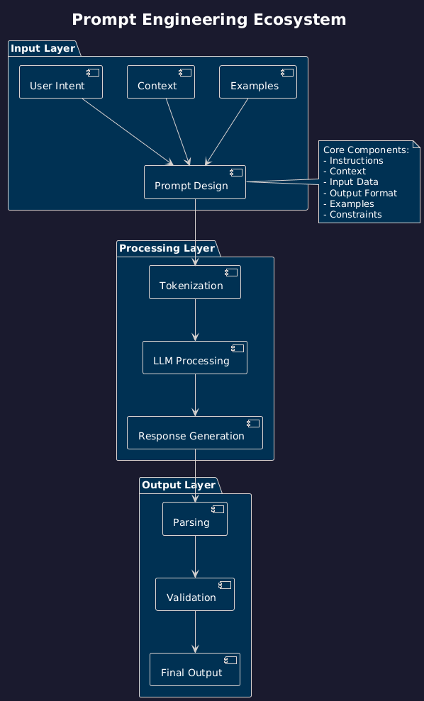

# The Complete Guide to Prompt Engineering: Mastering AI Communication
## Part 2 of 12: Building with the LLM Knowledge Hub

Welcome back to our 12-week journey through the LLM Knowledge Hub! This week, we dive deep into prompt engineering - the art and science of communicating effectively with AI models.

---

## 🎯 Series Navigation

**Previous:** Part 1: Building an Open-Source AI Knowledge Hub  
**Current:** Part 2: The Complete Guide to Prompt Engineering  
**Next:** Part 3: Context Management and Memory Systems

---

## 📚 Resources for This Article

🔗 **GitHub Repository:** [github.com/OmarKAly22/llm-knowledge-hub](https://github.com/OmarKAly22/llm-knowledge-hub)  
🌐 **Live Platform:** [llm-knowledge-hub.onrender.com](https://llm-knowledge-hub.onrender.com)

---

## Introduction

Prompt engineering is the practice of designing inputs that guide large language models (LLMs) to produce desired outputs. In our LLM Knowledge Hub, we've compiled comprehensive guides and examples that you can explore interactively on our live platform.

Though more art than science, systematic approaches have emerged from extensive experimentation. This guide synthesizes best practices from Google, OpenAI, Anthropic, and the broader AI research community.

**Important context:** LLMs evolve rapidly. Techniques that work today may become obsolete or be superseded by better approaches. Treat this guide as a foundation, not gospel, and always test with your specific model and use case.

<figure>
  
  <figcaption><em>Prompt Engineering Ecosystem</em></figcaption>
</figure>

### Prompt Engineering Ecosystem

---

## Part 1: Fundamentals

### 1.1 Anatomy of an Effective Prompt

Every prompt has potential components that serve different purposes:

**Core Components:**
- **Instructions** - What you want the model to do
- **Context** - Background information needed to complete the task
- **Input Data** - The specific content to process
- **Output Format** - How the response should be structured
- **Examples** - Demonstrations of the desired behavior
- **Constraints** - Boundaries or requirements for the output

**Example of a well-structured prompt:**

```python
# INSTRUCTION
Analyze the following customer review and extract key information.

# CONTEXT
You are a product analyst at an e-commerce company. We categorize 
sentiment as positive, negative, or neutral, and track specific 
product features mentioned.

# OUTPUT FORMAT
Return your analysis as JSON:
{
  "sentiment": "positive|negative|neutral",
  "confidence": 0-100,
  "features_mentioned": ["feature1", "feature2"],
  "key_issues": ["issue1", "issue2"],
  "summary": "brief summary"
}

# EXAMPLES
Input: "The battery life is amazing but the screen is too dim."
Output: {
  "sentiment": "neutral",
  "confidence": 75,
  "features_mentioned": ["battery", "screen"],
  "key_issues": ["screen brightness"],
  "summary": "Positive battery feedback, concern about screen brightness"
}

# INPUT
"I've had this laptop for two weeks and I'm already seeing lag when 
running multiple applications. The keyboard feels cheap too."
```

### 1.2 Prompt Structure & Delimiters

Why structure matters: Clear boundaries prevent the model from confusing instructions with content, especially when processing user-generated text that might contain instructions.

**Common delimiter strategies:**

**XML Tags (recommended for complex tasks):**
```xml
<instructions>
Translate the following text to French.
</instructions>
<text>
Hello, how are you?
</text>
```

**Markdown Headers:**
```markdown
## Task
Summarize the article below in 3 bullet points.

## Article
[content here]
```

**Triple Quotes or Back-ticks:**
```python
Analyze the sentiment of this text:
"""
I loved the product but shipping took forever.
"""
```

**Benefits of delimiters:**
- Prevents prompt injection attacks
- Improves parsing accuracy
- Makes prompts more maintainable
- Clarifies intent for complex multi-part prompts

### 1.3 System vs User Messages

Modern chat-based LLMs distinguish between message types:

<figure>
  
  <figcaption><em>System vs User Messages</em></figcaption>
</figure>

#### System vs User Messages

**System Messages:**
- Set the overall behavior, role, and capabilities
- Persist across the conversation
- Typically processed with higher priority
- Best for: defining rules, setting tone, establishing constraints

**User Messages:**
- Contain the specific task or query
- Can include context and examples
- Best for: actual requests, input data, task variations

**Example:**
```python
SYSTEM: You are a Python coding assistant. Always include type hints 
and docstrings. Prefer list comprehensions over loops where readable. 
Follow PEP 8 style guidelines.

USER: Write a function that filters even numbers from a list.
```

---

## Part 2: Core Techniques

### 2.1 Zero-Shot Prompting

**Definition:** Providing only task instructions without examples.

**When to use:**
- Simple, well-defined tasks
- When you want maximum flexibility
- Tasks the model is known to handle well
- Cost-sensitive applications (shorter prompts)

**Example:**
```python
Translate the following English text to Spanish:
"The quick brown fox jumps over the lazy dog."
```

**Advantages:**
- Minimal prompt engineering required
- Fastest to implement
- Lowest token cost

**Limitations:**
- Less control over output format
- Higher variance in quality
- May not work for specialized tasks

### 2.2 One-Shot & Few-Shot Prompting

**Definition:** Providing examples to demonstrate the desired behavior.

**How many examples?**
- **One-shot:** Single example, useful when the pattern is clear
- **Few-shot:** 3–5 examples is typical, more for complex tasks
- Diminishing returns after ~10 examples
- Quality > quantity: diverse, high-quality examples matter most

**Few-shot example:**
```python
Extract the name, email, and phone number from business cards.

Example 1:
Input: "Josef aly | CEO | josef@acme.com | (555) 123-4567"
Output: {"name": "Josef aly", "email": "josef@acme.com", "phone": "(555) 123-4567"}

Example 2:
Input: "Sahar Ahmed, Marketing Director, sahmed@company.org, 555.987.6543"
Output: {"name": "Sahar Ahmed", "email": "sahmed@company.org", "phone": "555.987.6543"}

Example 3:
Input: "Mona Salally| mona.salally@startup.io | +1-555-246-8135"
Output: {"name": "Mona Salally", "email": "mona.salally@startup.io", "phone": "+1-555-246-8135"}

Now extract from this business card:
"Ashraf Emad | CTO | ashraf.e@techcorp.com | 555-111-2222"
```

**Best practices for examples:**
- **Diversity:** Cover edge cases and variations
- **Relevance:** Match the actual task distribution
- **Clarity:** Make the pattern obvious
- **Balance:** For classification, include all classes roughly equally

### 2.3 Role & Context Prompting

**Role Prompting** assigns the model a specific identity:

```python
You are an experienced SQL database administrator with expertise in 
PostgreSQL optimization. When suggesting solutions, always consider 
performance implications and include explanations of query plans.
```

**Why it works:**
- Activates relevant knowledge in the model's training
- Sets expectations for tone and depth
- Provides implicit constraints

**Context Prompting** provides situational information:

```python
CONTEXT: You're helping a startup with 10,000 users migrate from MongoDB 
to PostgreSQL. They prioritize data integrity over downtime minimization. 
Their current database is 50GB with moderate write traffic (100 writes/sec).

TASK: Create a migration plan.
```

**Combining role and context:**
```python
ROLE: You are a senior software architect specializing in cloud-native 
applications.

CONTEXT: The client is migrating from a monolith to microservices. They 
have 5 developers, limited DevOps experience, and a 6-month timeline.

CONSTRAINTS: Solutions must be cost-effective and use managed services 
where possible to minimize operational burden.

TASK: Recommend a microservices architecture strategy.
```

### 2.4 Chain of Thought (CoT) Prompting

**Definition:** Encouraging the model to show its reasoning steps before reaching a conclusion.

<figure>
  
  <figcaption><em>Chain of Thought (CoT) Prompting</em></figcaption>
</figure>

#### Chain of Thought (CoT) Prompting

**Simple activation:** Add "Let's think step by step" or "Think through this carefully"

**Example without CoT:**
```
What is 15% of 240?
Answer: 36
```

**Example with CoT:**
```
What is 15% of 240? Let's think step by step.

Step 1: Convert percentage to decimal: 15% = 0.15
Step 2: Multiply: 240 × 0.15
Step 3: Calculate: 240 × 0.15 = 36
Answer: 36
```

**When CoT is most valuable:**
- Mathematical reasoning
- Multi-step logic problems
- Debugging and troubleshooting
- Complex decision-making
- Any task requiring intermediate steps

**Advanced CoT patterns:**

**Structured CoT:**
```python
Analyze whether this product review is authentic or potentially fake.
Use this reasoning framework:
1. Language patterns: [analyze writing style]
2. Specificity: [assess detail level]
3. Balanced perspective: [check for nuance]
4. Timing: [consider review date context]
5. Conclusion: [final determination]

Review: "This is the best product ever! Amazing! 5 stars! Buy now!"
```

**Zero-shot CoT:**
```python
The cafeteria had 23 apples. If they used 20 for lunch and bought 6 more, 
how many do they have?

Let's solve this step by step:
```

### 2.5 Self-Consistency

**Definition:** Running the same prompt multiple times with higher temperature, then selecting the most common answer.

**Process:**
1. Generate 5–10 responses with temperature 0.7–1.0
2. Extract the final answer from each
3. Use majority voting to select the most consistent answer

**Example application:**
```python
# Pseudo-code
prompt = "If a train travels 120 km in 2 hours, then 180 km in 3 hours, 
what's its average speed? Let's think step by step."

answers = []
for i in range(5):
    response = llm.generate(prompt, temperature=0.8)
    answer = extract_final_answer(response)
    answers.append(answer)

final_answer = most_common(answers)  # e.g., "60 km/h" appears 4/5 times
```

**Trade-offs:**
- **Pro:** Significantly improves accuracy on reasoning tasks
- **Con:** 5–10x more expensive
- **Con:** Slower due to multiple calls
- **Use when:** Accuracy is critical and cost is acceptable

### 2.6 Step-Back Prompting

**Definition:** First asking a general question about principles, then using that context to answer the specific question.

**Example:**

**Without step-back:**
```
What is the boiling point of water at the top of Mount Everest?
```

**With step-back:**
```
Step 1: What are the general principles that affect the boiling point of water?
Answer: Boiling point depends on atmospheric pressure. Lower pressure = lower boiling point.

Step 2: Given that Mount Everest has very low atmospheric pressure (about 1/3 of sea level), 
what would be the approximate boiling point of water?
Answer: At Mount Everest's summit (8,849m), water boils at approximately 72°C (162°F).
```

---

## Part 3: Advanced Techniques

### 3.1 ReAct (Reasoning + Acting)

**Definition:** Combining thought processes with actions in a loop.

<figure>
  
  <figcaption><em>ReAct: Reasoning + Acting Loop</em></figcaption>
</figure>

#### ReAct Framework

**Pattern:**
```
Thought → Action → Observation → (repeat)
```

**Example:**
```python
Question: What's the current population of Tokyo compared to 10 years ago?

Thought: I need to find Tokyo's current population.
Action: search("Tokyo current population 2024")
Observation: Tokyo's population is approximately 13.96 million as of 2024.

Thought: Now I need the population from 10 years ago (2014).
Action: search("Tokyo population 2014")
Observation: Tokyo's population was approximately 13.39 million in 2014.

Thought: I can now calculate the difference.
Action: calculate(13.96 - 13.39)
Observation: The difference is 0.57 million.

Answer: Tokyo's current population (13.96 million) has increased by 
approximately 570,000 people compared to 10 years ago (13.39 million in 2014).
```

### 3.2 Tree of Thoughts (ToT)

**Definition:** Exploring multiple reasoning paths simultaneously, like a chess player considering different moves.

**Process:**
1. Generate multiple initial thoughts
2. Evaluate each thought's promise
3. Expand the most promising branches
4. Backtrack if needed
5. Select the best path to the solution

**Example:**
```python
Problem: Design a creative marketing campaign for an eco-friendly water bottle.

Branch 1: Target environmentalists
├── Thought 1.1: Partner with environmental NGOs
├── Thought 1.2: "Save the oceans" campaign
└── Evaluation: Strong mission alignment but limited audience

Branch 2: Target fitness enthusiasts
├── Thought 2.1: "Hydrate responsibly" gym campaign
├── Thought 2.2: Partner with fitness influencers
└── Evaluation: Large audience, good product fit

Branch 3: Target students/young professionals
├── Thought 3.1: "Smart bottle for smart people" tech integration
├── Thought 3.2: Campus sustainability challenges
└── Evaluation: Viral potential, tech-forward approach

Selected path: Branch 3 → Develop campus challenge with gamification
```

### 3.3 Least-to-Most Prompting

**Definition:** Breaking complex problems into simpler subproblems, solving them sequentially.

**Process:**
1. Decompose the problem
2. Solve subproblems from simplest to most complex
3. Use solutions to inform subsequent steps

**Example:**
```python
Complex problem: Build a recommendation system for an e-commerce platform.

Decomposition:
1. What data do we need? → User behavior, product features
2. How do we process user data? → Create user profiles
3. How do we measure similarity? → Cosine similarity, collaborative filtering
4. How do we generate recommendations? → Matrix factorization
5. How do we evaluate quality? → A/B testing, precision/recall

[Solve each sequentially, building on previous answers]
```

---

## Part 4: Optimization Strategies

### 4.1 Temperature & Parameters

**Temperature** controls randomness in outputs:
- **0.0:** Deterministic, best for factual tasks
- **0.3-0.7:** Balanced creativity and coherence
- **0.8-1.0:** Creative, diverse outputs
- **>1.0:** Experimental, often incoherent

**Top-p (nucleus sampling):** Consider only tokens with cumulative probability < p  
**Top-k:** Consider only the k most likely next tokens

**Example configurations:**
```python
# Factual Q&A
config = {"temperature": 0, "top_p": 1.0}

# Creative writing
config = {"temperature": 0.8, "top_p": 0.9}

# Code generation
config = {"temperature": 0.2, "top_p": 0.95}

# Brainstorming
config = {"temperature": 0.9, "top_p": 0.95, "top_k": 50}
```

### 4.2 Prompt Compression

**Goal:** Reduce token count while maintaining effectiveness.

**Techniques:**
- Remove redundant instructions
- Use abbreviations consistently
- Compress examples to essential elements
- Use symbolic notation where appropriate

**Example optimization:**
```python
# Before (87 tokens):
"""
Please analyze the sentiment of the following customer review. 
Determine if it is positive, negative, or neutral. Also identify 
any specific product features that are mentioned. Format your 
response as JSON with fields for sentiment, features, and confidence.
"""

# After (42 tokens):
"""
Analyze review sentiment (pos/neg/neutral) and product features.
Output JSON: {sentiment, features[], confidence%}
"""
```

---

## Part 5: Domain-Specific Applications

### 5.1 Code Generation

**Best practices:**
```python
# Effective code generation prompt
"""
Language: Python
Task: Binary search implementation
Requirements:
- Type hints
- Docstring
- Handle edge cases
- O(log n) complexity
- Return -1 if not found

Include 2 test cases.
"""
```

**Output format specification:**
```python
def binary_search(arr: List[int], target: int) -> int:
    """
    Performs binary search on a sorted array.
    
    Args:
        arr: Sorted list of integers
        target: Value to search for
    
    Returns:
        Index of target if found, -1 otherwise
    """
    # Implementation here
```

### 5.2 Data Analysis

**Structured analysis prompt:**
```python
"""
Dataset: Sales data Q3 2024
Columns: date, product_id, quantity, revenue, region

Tasks:
1. Summary statistics by region
2. Top 5 products by revenue
3. Month-over-month growth rate
4. Identify anomalies

Output format: Markdown report with tables and insights
"""
```

### 5.3 Creative Writing

**Story generation with constraints:**
```python
"""
Genre: Science fiction mystery
Setting: Mars colony, 2087
Constraint: Exactly 500 words
Elements to include:
- Unreliable narrator
- Red herring about oxygen shortage
- Twist ending

Tone: Noir detective style
"""
```

---

## Part 6: Evaluation & Testing

### 6.1 Metrics for Prompt Quality

**Quantitative metrics:**
- **Accuracy:** Correct outputs / Total outputs
- **Consistency:** Variance across multiple runs
- **Format compliance:** Outputs matching specified format
- **Token efficiency:** Quality / Token count

**Qualitative metrics:**
- **Relevance:** How well output addresses the task
- **Coherence:** Logical flow and structure
- **Completeness:** All requirements addressed
- **Creativity:** For open-ended tasks

### 6.2 A/B Testing Framework

```python
# Simple A/B testing implementation
def test_prompts(prompt_a, prompt_b, test_cases, model, metric_fn):
    results_a = []
    results_b = []
    
    for test_case in test_cases:
        # Test Prompt A
        response_a = model.generate(prompt_a.format(input=test_case))
        results_a.append(metric_fn(response_a, test_case))
        
        # Test Prompt B
        response_b = model.generate(prompt_b.format(input=test_case))
        results_b.append(metric_fn(response_b, test_case))
    
    return {
        "prompt_a": {"mean": np.mean(results_a), "std": np.std(results_a)},
        "prompt_b": {"mean": np.mean(results_b), "std": np.std(results_b)},
        "winner": "A" if np.mean(results_a) > np.mean(results_b) else "B"
    }
```

### 6.3 Regression Testing

**Test suite structure:**
```python
test_suite = {
    "basic_functionality": [
        {"input": "simple_case", "expected": "correct_output"},
        {"input": "edge_case", "expected": "handled_properly"}
    ],
    "format_compliance": [
        {"input": "test_json", "validator": is_valid_json},
        {"input": "test_list", "validator": is_list_format}
    ],
    "performance": [
        {"input": "large_input", "max_tokens": 1000},
        {"input": "complex_task", "max_time": 5.0}
    ]
}
```

---

## Part 7: Common Pitfalls & Solutions

### 7.1 Hallucination

**Problem:** Model generates plausible but false information.

**Solutions:**
```python
# Bad: Open-ended
"Tell me about Company X's Q3 earnings"

# Good: Constrained
"Based on the Q3 earnings report below, what was the revenue?
If the information is not in the report, respond with 'Information not found.'
Report:
{actual_report_text}
"
```

**Additional strategies:**
- Require citations to source text
- Use retrieval-augmented generation
- Lower temperature for factual tasks
- Implement fact-checking step

### 7.2 Over-fitting to Examples

**Problem:** Model copies example format too literally instead of generalizing.

**Solution: Diverse examples**
```python
# Bad: Too similar
Example 1: "Great product" → Positive
Example 2: "Amazing quality" → Positive
Example 3: "Love it" → Positive

# Good: Diverse
Example 1: "Great product, fast shipping" → Positive
Example 2: "Terrible quality, broke immediately" → Negative
Example 3: "It's okay, nothing special" → Neutral
Example 4: "Love the design but poor battery" → Mixed
```

### 7.3 Inconsistent Outputs

**Problem:** Same input produces different outputs.

**Solutions:**
```python
# Use temperature 0 for deterministic tasks
temperature = 0.0

# Add explicit consistency instruction
"Be consistent with previous outputs. If you've classified similar 
inputs as X, classify this the same way unless there's a clear difference."

# Use self-consistency (multiple samples + voting)
```

### 7.4 Context Window Limits

**Problem:** Input + output exceeds model's maximum token limit.

**Solutions:**
```python
# Strategy 1: Chunking
Split long documents into chunks, process separately, then combine

# Strategy 2: Summarize first
"First, summarize this document in 200 words.
Then, answer this question based on your summary: {question}"

# Strategy 3: Extract relevant sections
Use embeddings or keyword search to find relevant sections before prompting

# Strategy 4: Map-reduce pattern
Process chunks in parallel, then synthesize results
```

---

## Part 8: Tools & Workflows

### 8.1 Prompt Management Tools

**LangChain / LlamaIndex:** Framework for building LLM applications
- Prompt templates
- Chain composition
- Memory management
- Tool integration

**PromptLayer / Helicone:** Monitoring and observability
- Log all prompts and outputs
- Track costs
- A/B testing
- Performance analytics

**Weights & Biases:** Experiment tracking
- Compare prompt versions
- Visualize performance metrics
- Team collaboration

### 8.2 Development Workflow

#### Prompt Engineering Development Workflow

<figure>
  
  <figcaption><em>Prompt Engineering Development Workflow</em></figcaption>
</figure>

### 8.3 Collaboration Best Practices

**Documentation template:**
```markdown
# Prompt: Product Review Sentiment Analysis
## Version: 3.2
## Last Updated: 2024-10-13P
## Owner: @omaraly

## Purpose
Classify product reviews into positive/negative/neutral/mixed sentiment

## Performance
- Accuracy: 87% (test set of 1000 reviews)
- Avg latency: 1.2s
- Avg cost: $0.005 per review

## Prompt
[Full prompt text]

## Test Cases
[Key test cases with expected outputs]

## Known Issues
- Struggles with sarcasm
- Mixed sentiment confidence is lower (72%)

## Changelog
- v3.2: Added few-shot examples for mixed sentiment (+8% accuracy)
- v3.1: Clarified output format (+15% format compliance)
- v3.0: Added role prompting (+5% accuracy)
```

---

## Part 9: Emerging Techniques & Future Directions

### 9.1 Constitutional AI

Training models to critique and refine their outputs based on explicit principles:

```python
Generate a response, then evaluate it against these principles:
1. Helpfulness: Does it fully address the question?
2. Harmlessness: Does it avoid harmful content?
3. Honesty: Does it acknowledge uncertainty?
4. Accuracy: Are factual claims correct?

Revise the response to better align with these principles.
```

### 9.2 Multi-modal Prompting

Combining text, images, and other modalities:

```python
IMAGE: [product photo]
TEXT PROMPT: Describe this product in a way that would appeal to 
eco-conscious millennials. Include:
- Visual features
- Inferred materials
- Sustainability aspects
- Lifestyle fit
```

### 9.3 Fine-tuning vs Prompting

**When to consider fine-tuning instead:**
- Highly specialized domain (medical, legal)
- Need consistent style/tone impossible via prompting
- Very high volume (cost-effective after breaking even)
- Proprietary knowledge not in training data
- Specific format requirements hard to enforce

**When prompting is sufficient:**
- General tasks
- Low-medium volume
- Flexibility needed
- Rapid iteration required
- No sensitive training data

---

## Conclusion

Prompt engineering is equal parts science and art. The techniques in this guide provide a strong foundation, but mastery comes from:

- **Experimentation** - Test variations systematically
- **Measurement** - Track what works and what doesn't
- **Adaptation** - Adjust as models and requirements evolve
- **Simplicity** - Start simple, add complexity only when needed

**Key Takeaways:**
- Structure your prompts clearly with delimiters
- Use examples when format or style matters
- Break complex tasks into simpler steps
- Test rigorously with edge cases
- Monitor and iterate continuously
- Prioritize clarity over cleverness

The field evolves rapidly. Stay curious, share learning, and build on the collective knowledge of the community.

---

## Resources & Next Steps

### Explore the Code:
📚 **Full Guide:** GitHub - Prompt Engineering Guide  
🌐 **Interactive Platform:** [llm-knowledge-hub.onrender.com](https://llm-knowledge-hub.onrender.com)

### Official Documentation:
- OpenAI Prompt Engineering Guide
- Anthropic Prompt Engineering Docs
- Google Prompt Engineering Best Practices
- Microsoft Azure OpenAI Prompt Engineering

### Research Papers:
- "Chain-of-Thought Prompting Elicits Reasoning in Large Language Models"
- "Large Language Models Are Zero-Shot Reasoners"
- "ReAct: Synergizing Reasoning and Acting in Language Models"
- "Tree of Thoughts: Deliberate Problem Solving with Large Language Models"

### Community Resources:
- PromptEngineering
- LangChain Documentation
- Prompt Engineering Daily Newsletter
- AI Discord communities

---

## Next Week in the Series

**Part 3: Context Management and Memory Systems**  
We'll dive deep into how to manage context windows, implement memory systems, and build stateful AI applications. Learn how to overcome token limitations and create AI systems that remember.

---

*Found this guide helpful? Star our [GitHub repository](https://github.com/OmarKAly22/llm-knowledge-hub) and follow me for the next article in this 12-part series! Share your prompt engineering experiences in the comments below.*

**#PromptEngineering #LLM #AI #OpenSource #MachineLearning #ArtificialIntelligence #Python #NLP #GenerativeAI #TechEducation #Programming #DataScience**
