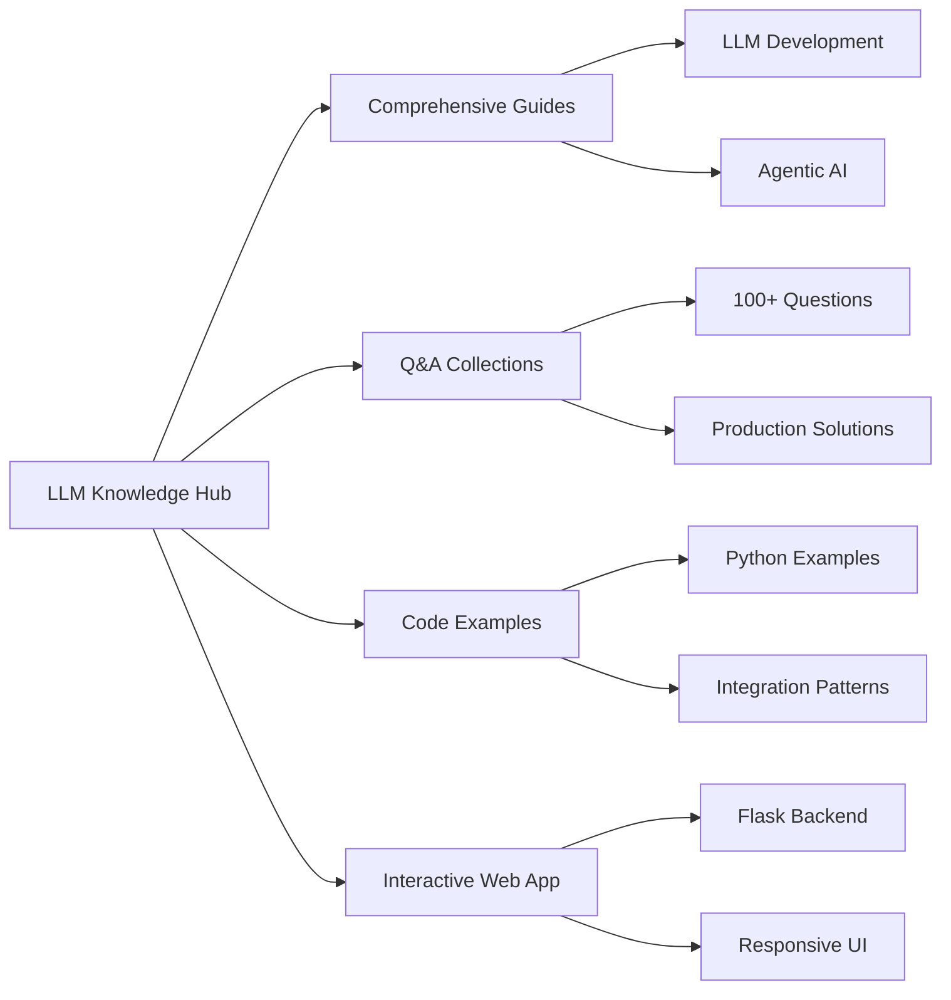

# 📚 LLM Knowledge Hub - Article Series

> A comprehensive 12-part series on building an open-source AI knowledge platform

[](https://github.com/OmarKAly22/llm-knowledge-hub)
[](https://llm-knowledge-hub.onrender.com/)
[](https://medium.com/@omark.k.aly)

---

## 🚀 About This Series

Welcome to the official documentation and article series for the **LLM Knowledge Hub** - an open-source platform that consolidates everything you need to know about building with Large Language Models and AI Agents.

This 12-part series takes you behind the scenes of building an educational AI platform from scratch, sharing not just the *what*, but the *why* and *how*.

---

## 📖 Articles

### Published

#### [Part 1: Introduction to the LLM Knowledge Hub](./docs/articles/article-01-introduction.md)
*Published: October 20, 2025*

🎯 **What You'll Learn:**
- Project architecture and vision
- Technology stack overview
- How to get started with the platform
- Roadmap for the entire series

📊 **Topics Covered:** System Architecture | Flask | Open Source | Project Overview

[Read Article →](./docs/articles/article-01-introduction.md) | [Medium Version →](https://medium.com/@omark.k.aly/cd287d538d84)

---

### Coming Soon

#### Part 2: The Complete Guide to Prompt Engineering
*Publishing: October 27, 2025*

🎯 **What You'll Learn:**
- Zero-shot to few-shot prompting
- Chain of Thought reasoning
- Advanced prompting patterns
- Production-ready techniques

📊 **Topics Covered:** Prompt Engineering | CoT | Few-Shot Learning | Best Practices

---

#### Part 3: Building with Flask - The Technical Foundation
*Publishing: November 3, 2025*

🎯 **What You'll Learn:**
- Flask application architecture
- Route design patterns
- Template system implementation
- Content management strategy

📊 **Topics Covered:** Flask | Python | Web Development | Backend Architecture

---

#### Part 4: Mastering LLM Development - Core Concepts
*Publishing: November 10, 2025*

🎯 **What You'll Learn:**
- LLM integration patterns
- Context window management
- Token optimization strategies
- API best practices

📊 **Topics Covered:** LLM Integration | Token Management | API Design | Optimization

---

#### Part 5: Agentic AI Architecture - Building Autonomous Systems
*Publishing: November 17, 2025*

🎯 **What You'll Learn:**
- Agent design patterns
- Tool integration strategies
- Memory systems implementation
- Multi-agent orchestration

📊 **Topics Covered:** AI Agents | ReAct Pattern | Tool Use | Memory Systems

---

#### Part 6: RAG Implementation - Connecting LLMs to Your Data
*Publishing: November 24, 2025*

🎯 **What You'll Learn:**
- Retrieval-Augmented Generation deep dive
- Vector database selection
- Embedding strategies
- Production RAG pipelines

📊 **Topics Covered:** RAG | Vector Databases | Embeddings | Information Retrieval

---

#### Part 7: Testing and Evaluation in the Age of AI
*Publishing: December 1, 2025*

🎯 **What You'll Learn:**
- Testing non-deterministic systems
- LLM evaluation metrics
- Quality assurance strategies
- Benchmark creation

📊 **Topics Covered:** Testing | Evaluation | QA | Benchmarking

---

#### Part 8: Security and Safety - Protecting AI Systems
*Publishing: December 8, 2025*

🎯 **What You'll Learn:**
- Prompt injection prevention
- Data privacy implementation
- Safety guardrails design
- Security best practices

📊 **Topics Covered:** Security | Safety | Prompt Injection | Privacy

---

#### Part 9: Cost Optimization - Making AI Economically Viable
*Publishing: December 15, 2025*

🎯 **What You'll Learn:**
- Token usage optimization
- Model selection strategies
- Caching implementations
- Cost monitoring tools

📊 **Topics Covered:** Cost Optimization | Caching | Model Selection | Efficiency

---

#### Part 10: Open Source Contribution - Building Together
*Publishing: December 22, 2025*

🎯 **What You'll Learn:**
- Contributing to the Knowledge Hub
- Open source best practices
- Community building strategies
- Documentation standards

📊 **Topics Covered:** Open Source | Community | Contributing | Documentation

---

#### Part 11: Deployment and DevOps for AI Applications
*Publishing: December 29, 2025*

🎯 **What You'll Learn:**
- Render deployment configuration
- Scaling AI applications
- Monitoring and logging
- CI/CD for AI projects

📊 **Topics Covered:** Deployment | DevOps | Render | Scaling

---

#### Part 12: Future of AI Engineering - Trends and Predictions
*Publishing: January 5, 2026*

🎯 **What You'll Learn:**
- Emerging AI patterns
- Industry trends analysis
- Future roadmap
- Building next-gen AI systems

📊 **Topics Covered:** Future Trends | Industry Analysis | Predictions | Innovation

---

## 🛠️ Quick Start

### Run Locally

```bash
# Clone the repository
git clone https://github.com/OmarKAly22/llm-knowledge-hub.git
cd llm-knowledge-hub

# Set up virtual environment
python -m venv venv
source venv/bin/activate  # On Windows: venv\Scripts\activate

# Install dependencies
pip install -r requirements.txt

# Run the application
python app.py

# Visit http://localhost:5000
```

### Access Online

🌐 **Live Platform**: [llm-knowledge-hub.onrender.com](https://llm-knowledge-hub.onrender.com/)

---

## 📊 Project Overview



---

## 🤝 Contributing

The LLM Knowledge Hub is open for contributions! Here's how you can help:

1. **⭐ Star the Repository** - Show your support
2. **🐛 Report Issues** - Help improve the content
3. **📝 Submit PRs** - Contribute guides, examples, or fixes
4. **💬 Join Discussions** - Share your ideas and feedback

### Contribution Areas

- 📚 **Content**: Add new guides, Q&A entries, or examples
- 🐞 **Bug Fixes**: Help identify and fix issues
- 🎨 **UI/UX**: Improve the web interface
- 📖 **Documentation**: Enhance documentation and tutorials
- 🌍 **Translations**: Help make content accessible globally

---

## 👤 Author

**Omar Aly**

- 📧 Email: omark.k.aly@gmail.com
- 🐙 GitHub: [@OmarKAly22](https://github.com/OmarKAly22)
- 📝 Medium: [@omark.k.aly](https://medium.com/@omark.k.aly)
- 💼 LinkedIn: [Connect on LinkedIn](https://www.linkedin.com/in/your-profile)

---

## 📜 License

This project is licensed under the MIT License - see the [LICENSE](https://github.com/OmarKAly22/llm-knowledge-hub/blob/main/LICENSE) file for details.

---

## 🙏 Acknowledgments

- The AI/ML community for continuous inspiration
- Open source contributors who make projects like this possible
- Every developer working to democratize AI knowledge
- You, for taking interest in this journey

---

## 📈 Project Stats


---

<div align="center">
  <h3>📖 Start Reading the Series</h3>
  <a href="./docs/articles/article-01-introduction.md">
    
  </a>
</div>

---

<div align="center">
  Made with ❤️ by <a href="https://github.com/OmarKAly22">Omar Aly</a>
</div>